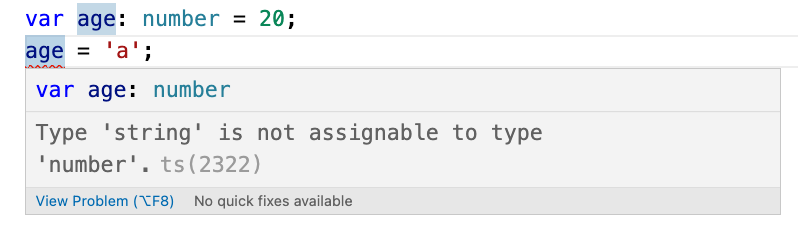

# Codice
Il codice TS viene normalmente salvato in files con estenzione `.ts`.

## Niente di nuovo
Partiamo con qualcosa di semplice: creiamo un file test.ts e ci scriviamo dentro 
```typescript
console.log('Hello world');
```
Ora proviamo a compilarlo: 
```bash
tsc test.ts
```

TS prende il nostro file TS e lo ricompila in un eseguibile JS. Se non ci sono error (e non dovremmo esserci) avremo un nuovo file: `test.js` il cui contenuto dovrebbe essere:

```javascript
console.log('Hello world');
```
Poiché era solo codice JS nulla dovrebbe essere cambiato e entrambi i file dovrebbero poter essere eseguiti da NodeJS

 ```bash
$ node test.ts
 Hello world

$ node test.js
 Hello world
 ```

## Variabili tipizzate
Ora proviamo con qualcosa tipo una variabile tipizzata.
```typescript
let age: number = 20;
```
Se dovessimo provare ad eseguirlo con NodeJS avremo questo errore:
``` bash
$ node test.ts
/Volumes/code/learn/TypeScript/test.ts:1
let age: number = 20;
       ^

SyntaxError: Unexpected token ':'
```

NodeJS processa solo JS e la nostra riga di codice deve essere compilata:
```bash
$ tsc test.ts
$ node test.js
$
```
Node non ci darà errore, ma allo stesso tempo non darà nessun risultato. Questo perché all'interno del file `test.js` ci dovrebbe essere solo questo:
```javascript
var age = 20;
```
Tutto corretto quindi, per visualizzare dovremmo avere qualcosa come `console.log()`, ma nel nostro file TS non c'era quindi tutto ok :)

## Errori di compilazione
Riapriamo il nostro file `test.ts` ed aggiungiamo una riga
```typescript
var age: number = 20;
age = 'a';
```
TS dovrebbe avvertirci dell'errore prima di arrivare alla compilazione:


In ogni caso possiamo provare comunque:
```bash
$ tsc test.ts             
test.ts:2:1 - error TS2322: Type 'string' is not assignable to type 'number'.

2 age = 'a';
  ~~~


Found 1 error in test.ts:2
$
```
