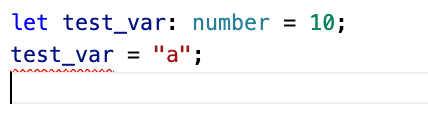

# Cos'é TypeScript(TS)
É un linguaggio costruito da MicroSoft(MS) sulla base di JavaScript(JS) per ovviare alcuni problemi legati alla natura di JS e renderlo più adatto ad essere usato in contesti più ampi. Si può pensare a TS come ad una versione più moderna o avanzata di JS. MS ha pensato bene di aggiungere alcune parti/funzioni per rendere JS un linguaggio più strutturato e adatto a gestire lo sviluppo e l'aggiornamento di programmi più complessi.


# Vantaggi

## Linguaggio fortemente tipizzato
TS invece é un linguaggio fortemente tipizzato, questo significa che se crei una variabile di tipo `int` non potrai usarla per stringhe o altro che non sia un `int`.

JS invece é un linguaggio a tipizzazione dinamica, questo significa che puoi creare una variabile di tipo `integer` ma poi puoi trasformarla in una `string` e cosí via. Questo rende molto elastica la programmazione ma in alcune situazioni rende impossibile prevedere errori di runtime.

```Javascript
let number = 10;
number = "a";
let res = Math.round(number); 
console.log(res);
NaN // errore :)
```
Se avessimo usato TS l'editor si accorgerebbe dell'errore mentre lo state ancora scrivendo, ma se anche non avessimo un editor di base, TS ci avvertirebbe in fase di compilazione.



```typescript
var test_var = 10;
test_var = "a";
```
```bash
$tsc test.ts
test.ts:2:1 - error TS2322: Type 'string' is not assignable to type 'number'.

2 test_var = "a";
  ~~~~~~~~
Found 1 error in test.ts:2
```

## Integrazione con editor
Quasi tutti gli editor (o IDE) hanno una forte integrazione con TS e questo permette di avere funzioni `code completion` (suggerimenti automatici), `refactoring` (riscrittura) e `JS new features` che vengono direttamente da TS e questo rende molto produttivo lavorare con TS.

# Svantaggi
## Compilazione
Tutto quello che scriviamo in TS deve essere ricompilato in JS per poter essere utilizzato, sia nei browser che in NodeJS

## Elasticità
Sicureamente TS é meno elastico di JS e questo può significare una perdita di velocità nel breve termine. Ma una volta che ci si abitua, lo sviluppo, soprattuto per progetti piú complessi, dove sono coinvolti più programmatori (o attori), tutto diventerà più veloce e snello.


