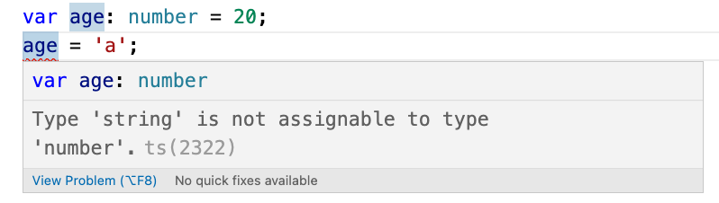

# Sintassi
Il codice TS viene normalmente salvato in files con estenzione `.ts`.

## Niente di nuovo
Partiamo con qualcosa di semplice: creiamo un file test.ts e ci scriviamo dentro 
```typescript
console.log('Hello world');
```
Ora proviamo a compilarlo: 
```bash
tsc test.ts
```

TS prende il nostro file TS e lo ricompila in un eseguibile JS. Se non ci sono error (e non dovremmo esserci) avremo un nuovo file: `test.js` il cui contenuto dovrebbe essere:

```javascript
console.log('Hello world');
```
Poiché era solo codice JS nulla dovrebbe essere cambiato e entrambi i file dovrebbero poter essere eseguiti da NodeJS

 ```bash
$ node test.ts
 Hello world

$ node test.js
 Hello world
 ```

## Variabili tipizzate
Ora proviamo con qualcosa tipo una variabile tipizzata.
```typescript
let age: number = 20;
```
Se dovessimo provare ad eseguirlo con NodeJS avremo questo errore:
``` bash
$ node test.ts
/Volumes/code/learn/TypeScript/test.ts:1
let age: number = 20;
       ^

SyntaxError: Unexpected token ':'
```

NodeJS processa solo JS e la nostra riga di codice deve essere compilata:
```bash
$ tsc test.ts
$ node test.js
$
```
Node non ci darà errore, ma allo stesso tempo non darà nessun risultato. Questo perché all'interno del file `test.js` ci dovrebbe essere solo questo:
```javascript
var age = 20;
```
Tutto corretto quindi, per visualizzare dovremmo avere qualcosa come `console.log()`, ma nel nostro file TS non c'era quindi tutto ok :)

## Errori di compilazione
Riapriamo il nostro file `test.ts` ed aggiungiamo una riga
```typescript
var age: number = 20;
age = 'a';
```
TS dovrebbe avvertirci dell'errore prima di arrivare alla compilazione:


In ogni caso possiamo provare comunque:
```bash
$ tsc test.ts             
test.ts:2:1 - error TS2322: Type 'string' is not assignable to type 'number'.

2 age = 'a';
  ~~~


Found 1 error in test.ts:2
$
```

## Types in JS
JS ha una lista molto limitata di types:
- number
- string
- boolean
- null
- undefined
- object

## Types in TS
- tutti quelli di JS 
- [any](/md/sintassi.md#any)
- unknown
- never
- [enums](./sintassi.md#enums)
- [tuples](./sintassi.md#tuples)

## Numbers underscore
```typescript
/*
in typescript i numeri possono essere intervallati 
da underscore, questo può aiutare nel definire i
numeri più grandi
*/ 
let sales: number = 123456789;
let sales: number = 123_456_789;
```

# Types annotations
Quando dichiariamo una variabile possiamo usare una 
annotation che dichiara in maniera esplicita il type 
che vogliamo asssegnare alla variabile.

```typescript
let test1: number = 123_456_789;
/*
ma questa dichiarazione é ridondante se assegnamo 
un valore alla variabile quindi possiamo ometterla
*/
let test2 = 123_456_789;

// altrimenti dovremmo esplicitarla
let test3: number;

/*
se non esplicitata la variabile sarà creata una 
variabile di tipo any
*/
let test4;
```

## any
La variabile di tipo `any` disabilita il controllo che TS esegue sulla tipologia della variabile. Praticamente una variabile di tipo `any` si comporta come una qualsiasi variabile JS vanificando la caratteristica principale di TS. Per questo motivo é fortemente sconsigliato l'utilizzo di variabili di tipo `any`.


## tuples
Le varibili di tipo tuples ci consentono di definire array di dimensione definita e un tipo per ogni variabile

```typescript
let tuple1: [number, string] = [1, 'test'];
let tuple2: [number, string] = [1, 'test', 3]; // error
```

## enums
Enumb rappresenta un numero limitato di valori possibili per una variabile.

```typescript
/*
i valori non esplicitati sono 0 (per il primo) 
e +1 sul precedente su tutti gli altri (in questo 
caso 0, 1, 2)
*/
enum sizesA { small, medium, large};
// in questo caso 3,4,5
enum sizesB { small=3, medium, large};
// in questo caso 0,5,10
enum sizesC { small = 0, medium = 5, large = 10};

// uso
let mySize: sizesA = sizesA.medium; // 1
let mySize: sizesB = sizesA.medium; // 4
let mySize: sizesC = sizesA.medium; // 5

/*
nel caso di stringhe tutti i valori devono essere 
esplicitati. In questo caso small = 0, medium = 'a' 
e large provoca un errore
*/
enum sizesD { small, medium='a', large};
```

## arrays
Gli array sono presenti in JS e come tutte le altre variabili non hanno nessun tipo di limitazione: un array può contenere un numero illimitato di valori senza nessun controllo sul tipo dei singoli valori. In TS é possibile descrivere meglio come vogliamo costruire gli array.
```typescript
/*
questo array dovrebbe contenere solo numberi 
e provocherà un errore
*/
let numbers: number[] = [1, 2, '3'];
```
## functions
Con TS possiamo creare delle funzioni che accettano parametri di tipi specifici e che restituiscono risultati di tipi specifici.

```typescript
// errore se noUnusedParameters = true
function calculateTax1(income: number): number
{
    return 0;
}
// ok
function calculateTax2(income: number): number
{
    if (income < 50_000)
        return 0;
    return Math.round(income/100*20);
}
/*
errore - TS deduce dal codice che se income é una 
string ci sarà un errore
*/
function calculateTax3(income: number|string): number
{
    if (income < 50_000)
        return 0;
    return Math.round(income/100*20);
}

// errore - Se income é maggiore di 50000
function calculateTax4(income: number): number
{
    if (income < 50_000)
        return 0;
}

/*
errore - se noImplicitReturns e void non é citato 
come possibile risultato
*/
function calculateTax5(income: number)
{
    if (income < 50_000)
        return 0;
}

/*
non il massimo ma funziona anche con 
noImplicitReturns = true
*/ 
function calculateTax6(income: number): number|void
{
    if (income < 50_000)
        return 0;
}

/*
anche la dichiarazione dei parametri può diventare 
implicita se si usa un valore di default. In questo
caso incomeYear sarà definito come number
*/
function calculateTax6(income: number, incomeYear = 2022): number
{
    let taxesPerc: number;

    if (incomeYear > 2000) {
        taxesPerc = 0.2;
    } else {
        taxesPerc = 0.4;
    }
    if (income < 50_000)
        return 0;

    return income * taxesPerc;
}
```

## objects
Quando dichiaramo un oggetto in JS é perfettamente normale che siano dinamici, e che si possa cambiare e aggiornare non solo quali e quante proprietà ma anche il tipo di ogni proprietà

```javascript
let employee = {id: 1};
employee.id = "01";
employee.name = "John";
```

In TS non solo non é consentito cambiare il tipo delle variabili, ma una volta definito un oggetto non é possibile aggiungere/eliminare proprietà.

```typescript
let employee = {id: 1};
// Type 'string' is not assignable to type 'number'.
employee.id = "01"; 
// Property 'name' does not exist on type '{ id: number; }'.
employee.name = "John"; 
```

Possiamo inoltre definire l'oggetto in maniera molto esatta:
```typescript
// valido
let employee1: 
{
    id: number,
    name: string
} = {id: 1, name: "John"};

// invalido (property name is missing)
let employee2: 
{
    id: number,
    name: string
} = {id: 1};
employee2.name = "John";

// valido (name ora é opzionale)
let employee3: 
{
    id: number,
    name?: string
} = {id: 1};
employee3.name = "John";

// readonly properties
let employee4: 
{
    readonly id: number,
    name: string
} = {id: 1, name: "John"};
employee4.id = 3; // invalido
```

Naturalmente é possibile dichiarare funzioni all'interno degli oggetti ed é possibile specificare i tipi per tutti i parametri e i risultati

```typescript
// funzioni all'interno degli oggetti
let employee5: 
{
    readonly id: number,
    name: string,
    retire: (date: Date) => boolean
} = {
    id: 1, 
    name: "John",
    retire: (date: Date) => {
        console.log(date);
        return true;
    }
};

```

# Advanced Types
## Type Alias
Abbiamo visto come dichiarare un oggetto può diventare complicato, ma soprattutto dovremo ripetere quella struttura ogni volta che avremo a che fare con quel tipo di oggetto. Per questo esistono i Type Alias
```typescript
type Employee = {
    readonly id: number,
    name: string,
    retire: (date: Date) => boolean
}

let employee5: Employee = {
    id: 1, 
    name: "John",
    retire: (date: Date) => {
        console.log(date);
        return true;
    }
};
```

## Union Types
Il segno `|` pipe ci consente di avere più di un type per ogni argomento o risultato. Questo strumento va utilizzato con molta cautela.
Per avere migliori risultati si consiglia di usare questo strumento in congiunzione con il narrowing: ossia l'uso della funzione `typeof` per eseguire codice in base al tipo selezionato. TS é intelligente e controlla che i controlli usando `typeof` siano eseguiti correttamente e suggerisce all'editor solo le funzioni adatte al tipo di variabile nella situazione selezionata.

```typescript
function kgToLbs(weight: number|string): number
{
    // Narrowing
    if (typeof weight === 'number') {
        return weight * 2.2;
    } else {
        return parseInt(weight) * 2.2;
    }
}

console.log(kgToLbs(10));
console.log(kgToLbs("10kg"));
```

## Intersection types
L'intersection ci per mette di unire due tipi di variabile nella stessa variabile usando il segno `&`. 

```typescript
type Draggable = {
    drag: () => void
};
type Resizable = {
    resize: () => void
};
type UiWidget = Draggable & Resizable;

let widget: UiWidget = {
    drag: () => {},
    resize: () => {}
};
```

## Literal Types
In alcune situazioni potrebbe essere utile avere un numero limitato di valori possibili per una variabile. Questo é possibile con i literal values:
```typescript
let qtt1: 50|100 = 50;
let qtt2: 50|100 = 52; // error
type Quantity = 50|100;
let qtt3: Quantity = 100;
let qtt4: Quantity = 43; // error
```

## Optional Chaining
Diciamo che vogliamo eseguire una operazione su un oggetto che potrebbe essere `null` o `undefined`.
Basterà aggiungere il carattere `?` e il codice sarà considerato valido solo se la variabile non sara `null` o `undefined`

```typescript
type Customer = {
    birthday: Date
}

function getCustomer(id: number): Customer|null|undefined
{
    if (id === 0) {
        return null;
    } else {
        return {birthday: new Date()};
    }
}

let customer  = getCustomer(0);

// standard
if (customer !== null && customer !== undefined) {
    console.log(customer.birthday);
}
// con optional chaining operator
console.log(customer?.birthday);
console.log(customer?.birthday?.getFullYear());
```

## Optional Call
Come l'[Optional Chaining](sintassi.md#optional-chaining) ma applicato alle funzioni

```typescript
// funzione valida 
let log_A: any = (message: string) => console.log(message);
let log_B: any = null;

log_A('a'); // tutto ok
log_B('a'); // errore
log_A?.('A'); // la funzione verrà eseguita 
log_B?.('A'); // la funzione non verrà eseguita
```